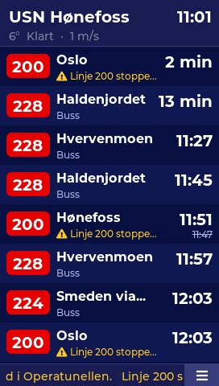
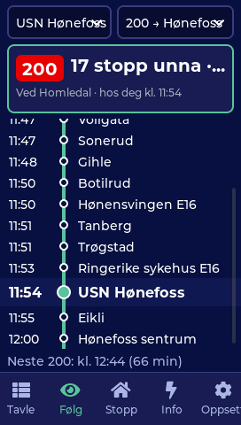
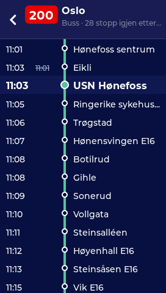
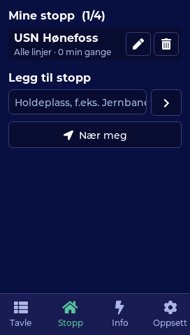
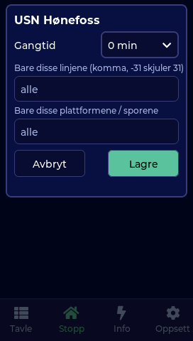
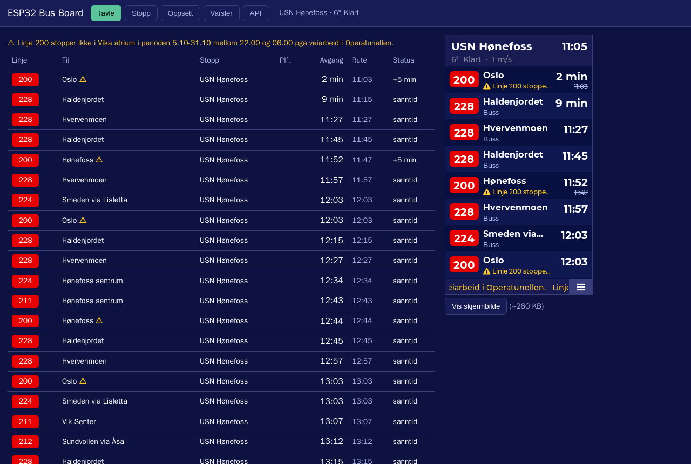

# ESP32 Bus Board

A live public-transport departure board for Norway on the **[JC4827W543](https://www.aliexpress.com/item/1005006729377800.html)** (ESP32-S3, 4.3" 272×480 touch display).
It is fed by [Entur](https://developer.entur.org/)'s open Journey Planner API, which covers every operator in the
country (Ruter, Brakar, Skyss, AtB, Kolumbus, Vy, Boreal, ferries, trams, metro, trains). No account or API key needed.

| Board | Track a line | Trip | Stops | Stop filters |
|---|---|---|---|---|
|  |  |  |  |  |



## Features

- **Departure board**: line badges in the operator's colours, destination, platform/track, realtime minutes
  ("nå", "4 min"), and clock time beyond a chosen horizon or when no realtime data exists (Ruter convention).
  Delays show the struck-out timetable time, and cancellations show as **INNSTILT**.
- **Up to 4 stops**, shown one at a time (swipe, tap the header, or auto-cycle) or **merged** into one list.
- **Per-stop filters**: only certain lines (`31,37`) or hide some (`-31`), only certain platforms/tracks, and
  **walking time**. Departures you can't reach are dimmed (or hidden), and the right one blinks **GÅ NÅ**.
- **Trip view**: tap a departure to see every stop on that trip with live times, your stop highlighted, and the
  vehicle's position from realtime data.
- **Track a line** (*Følg* page): pick a stop and a line + direction (e.g. 200 → Oslo) from the departures there,
  or tap the eye button on a trip. You see how many stops away the next bus is, which stop it's at, the stops
  leading up to yours with the vehicle marker, its arrival time at your stop, and the one after it. The board
  header shows "200: 4 stopp unna · 6 min", and that line's rows get an accent bar. It refreshes every 20 s
  while the page is open. Operators without actual-time reports get a timetable estimate (marked *beregnet*).
- **Disruption ticker** with Entur's situation messages, plus weather in the header (Open-Meteo).
- **Stop search on the device**: type a name (Norwegian keyboard with æ ø å) or tap *Near me*.
- **"Leave now" push alerts** for chosen lines within active hours (ntfy.sh / webhook).
- **Web panel** at `http://esp32-busboard.local`: live board, stop editor with search, all settings, Wi-Fi scan,
  alert log, screenshot, Prometheus `/metrics`, OTA firmware upload.
- **Home Assistant** via MQTT discovery: next and second departure (line and minutes), stop, disruption count.
- Four themes (Entur navy, Amber LED, Phosphor green, Day) and two languages (Norsk / English).
- Night dimming. On first boot it picks up the Wi-Fi credentials from the
  [ADS-B radar](https://github.com/frogswiper/esp32-adsb-radar), [ship radar](https://github.com/frogswiper/esp32-ship-radar)
  or [deskclock](https://github.com/frogswiper/esp32-deskclock) firmware, if one of them was installed before.

## Hardware

### Get the board

**[JC4827W543 on AliExpress](https://www.aliexpress.com/item/1005006729377800.html)** (Guition ESP32-S3 4.3″ display board). Choose the **capacitive-touch
version (JC4827W543C, GT911)** — the firmware drives the GT911; the resistive variant (JC4827W543R) will show the
screen but touch won't work. Any USB cable with data lines is enough to flash and power it.

| Component | Detail |
|---|---|
| Board | Guition JC4827W543**C** (capacitive) |
| SoC | ESP32-S3 (Xtensa LX7 dual core, 240 MHz), Wi-Fi 802.11 b/g/n 2.4 GHz + Bluetooth LE |
| Flash | 4 MB QIO — partition table `min_spiffs.csv`: two 1.9 MB OTA app slots (firmware uses ~72 %) |
| PSRAM | 8 MB OPI — LVGL objects, frame buffers, Entur JSON and departure tables live here |
| Display | 4.3″ TFT, 480×272, NV3041A controller on QSPI (32 MHz), rotated to 272×480 portrait |
| Touch | Goodix GT911 capacitive, I²C (address 0x5D) |
| Backlight | PWM on GPIO 1 (LEDC, 5 kHz, 8-bit) — brightness setting + night dimming |
| USB | native USB-Serial/JTAG: flashing, 115200 serial console, 5 V power |

**Pin map** (`firmware/src/board_config.h`)

| Function | GPIO |
|---|---|
| LCD QSPI CS / CLK | 45 / 47 |
| LCD QSPI D0 / D1 / D2 / D3 | 21 / 48 / 40 / 39 |
| LCD reset | not connected |
| Backlight | 1 |
| Touch SDA / SCL | 8 / 4 |
| Touch INT / RST | 3 / 38 |

**Quirks**

- The NV3041A on this board displays the colour negative of what it is sent and ignores INVON, so the LVGL
  flush callback XORs every pixel.
- The GT911 latches I²C address 0x5D only if INT is held low while RST rises; `display.cpp` does that before
  TouchLib starts.
- Opening the USB serial port with DTR/RTS toggling (most terminals, pyserial) resets the chip — see the
  serial section below.

## Install

Browser installer (Chrome/Edge, Web Serial): **https://frogswiper.cloud/esp32-bus-board/**

Or build it yourself with PlatformIO:

```
cd firmware
pio run -t upload --upload-port /dev/ttyACM0
```

## Data and APIs

| What | Endpoint |
|---|---|
| Departures (all stops in one GraphQL query) | `POST https://api.entur.io/journey-planner/v3/graphql` |
| Trip stops | same, `serviceJourney(id) { estimatedCalls(date) }` |
| Stop search / nearby | `https://api.entur.io/geocoder/v1/autocomplete` / `reverse` |
| Weather | `https://api.open-meteo.com/v1/forecast` |
| Position fallback | ip-api.com / ipwho.is |

Every Entur request sends `ET-Client-Name: frogswiper-esp32busboard`, as Entur asks. The board polls every 30 s by
default (minimum 15 s) and backs off to half rate when another page is open. Entur data is licensed under
[NLOD](https://data.norge.no/nlod/no/2.0).

## Web API

```
GET  /api/state      board JSON: departures, disruptions, fetch status, weather
GET  /api/stops      saved stops
POST /api/stops      [{"id":"NSR:StopPlace:16961","name":"Hønefoss sentrum","lines":"","quays":"","walk_min":4}, ...]
GET  /api/config     settings (passwords omitted)
POST /api/config     JSON subset of settings (incl. track_stop / track_line / track_dest)
GET  /api/alerts     alert log
GET  /api/wifi/scan  nearby networks
GET  /screen.bmp     live screenshot (16-bit BMP)
GET  /metrics        Prometheus
POST /ota            firmware.bin (403 unless armed on the device: Info page)
POST /api/action     {"action":"refresh"|"reboot"|"locate"|"next_stop"|"mode"|"page","page":0-4}
```

## Serial debug commands (115200 baud)

`S` screenshot (RGB565 dump, see `firmware/scripts/screenshot.py`), `1`–`5` pages, `J` open the trip of the first row,
`T` track page, `M` toggle merged view, `X` next stop, `A<NSR:StopPlace:id>` add a stop, `N` nearby search, `F` sample search,
`E`/`Q` open/close the stop editor, `K` keyboard, `O` theme dropdown, `R` reboot, `D` reset settings (keeps Wi-Fi).

The board's USB-JTAG port resets the chip when a terminal toggles DTR/RTS. To read without a reset, run
`stty -F /dev/ttyACM0 115200 raw -echo -hupcl` and use the raw-fd screenshot script.

## License notes

Montserrat (`tools/fonts`, and the generated `firmware/src/fonts`) is under the SIL Open Font License 1.1.
Entur data: NLOD 2.0.

## Fonts

- Fonts are Montserrat (Medium/Bold) converted with `lv_font_conv` for Latin-1, so place names render æ ø å é ü.
  Regenerate with `docker run --rm -v "$PWD":/w node:22-alpine sh /w/tools/fonts/gen.sh`.

## Layout

```
firmware/src/
  entur.cpp       GraphQL + geocoder client, filters, time formatting
  net_task.cpp    WiFi / HTTP work on core 0 (command queue, event bits)
  ui/ui_board.cpp departure board        ui/ui_journey.cpp  trip view
  ui/ui_stops.cpp stop search + editor   ui/ui_settings.cpp settings
  ui/theme.h      themes + shared widgets and keyboard
  web_server.cpp  panel + JSON API       web_page.h         panel HTML
  mqtt.cpp        Home Assistant discovery
```
